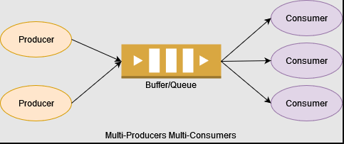
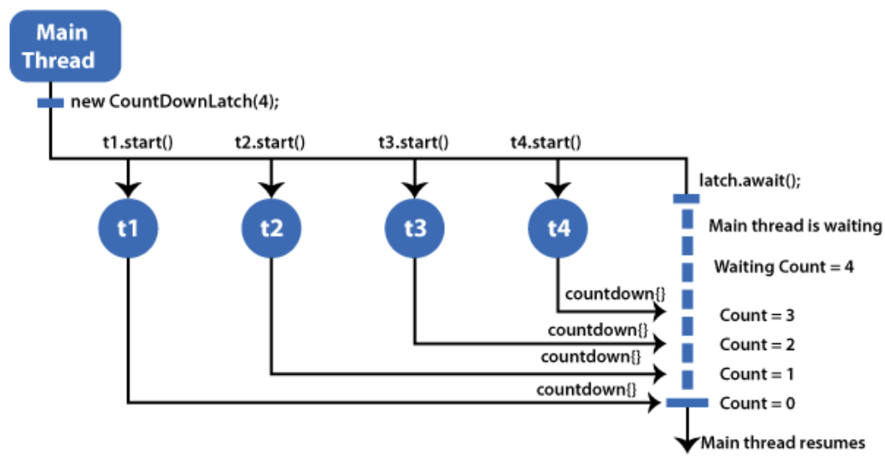

# Advanced Concurrency - Module 2

> This is a tutorials course covering advanced concurrency in Java.

Tools used:

- JDK 11
- Maven
- JUnit 5, Mockito
- IntelliJ IDE

## Table of contents

1. [Advanced Locking and Semaphores](https://github.com/backstreetbrogrammer/33_AdvancedConcurrencyModule2#chapter-01-advanced-locking-and-semaphores)
    - [Lock pattern](https://github.com/backstreetbrogrammer/33_AdvancedConcurrencyModule2#lock-pattern)
    - [Condition](https://github.com/backstreetbrogrammer/33_AdvancedConcurrencyModule2#condition)
    - [Read-Write Locks](https://github.com/backstreetbrogrammer/33_AdvancedConcurrencyModule2#read-write-locks)
    - [Semaphore Pattern](https://github.com/backstreetbrogrammer/33_AdvancedConcurrencyModule2#semaphore-pattern)
2. [Using Barriers and Latches](https://github.com/backstreetbrogrammer/33_AdvancedConcurrencyModule2#chapter-02-using-barriers-and-latches)
    - [Barriers](https://github.com/backstreetbrogrammer/33_AdvancedConcurrencyModule2#barriers)
    - [Latches](https://github.com/backstreetbrogrammer/33_AdvancedConcurrencyModule2#latches)

---

### Chapter 01. Advanced Locking and Semaphores

There are 2 ways of using **intrinsic** locking: `synchronization` and `volatile`.

```java
public class Student {

    public final Object lock = new Object();

    public void admit() {
        synchronized (lock) {
            // code for admission
        }
    }

}
```

This code prevents more than one thread to execute the `synchronized` block at the same time.

When several threads are trying to execute `admit()` => only 1 of them will be allowed to execute, all other threads
will have to **wait** for their turn (in the lock object's wait-queue).

What happens when the 1 thread executing the `admit()` method gets **blocked** inside the method (due to some bug)?

All the threads and the executing thread are **BLOCKED** => there is **NO** way to release them. ONLY way is to restart
the JVM!

#### Lock pattern

The **LOCK pattern** comes here for rescue.

```java
import java.util.concurrent.locks.Lock;
import java.util.concurrent.locks.ReentrantLock;

public class Student {

    public final Lock lock = new ReentrantLock();

    public void admit() {
        try {
            lock.lock();
            // code for admission
        } finally {
            lock.unlock();
        }
    }

}
```

Now whatever exception is thrown by the executing thread in the critical section (code for admission), `finally` block
will ensure to **RELEASE** the lock.

`Lock` is an interface, implemented by `ReentrantLock`. It offers the same guarantees as **mutual exclusion**, **read &
write ordering**, etc.

**Benefits of Lock pattern**

We have explicit control over the `Lock` object which defines several methods, in contrast to `Object` lock used in
`synchronized` block which only has `wait()`, `notify()` and `notifyAll()` methods.

- **Interruptible lock acquisition**

```java
import java.util.concurrent.locks.Lock;
import java.util.concurrent.locks.ReentrantLock;

public class Student {

    public final Lock lock = new ReentrantLock();

    public void admit() {
        try {
            lock.lockInterruptibly();
            // code for admission
        } catch (final InterruptedException e) {
            // if interrupted, release the waiting thread and do something else
            e.printStackTrace();
        } finally {
            lock.unlock();
        }
    }

}
```

The threads waiting to acquire the lock => if they are interrupted by another thread (by calling `interrupt()` method on
that waiting threads references) - they will throw the `InterruptedException`.

Now the waiting threads are released and can be used for other work or again wait => developer is free to use it.

This pattern is useful to kill a contingent of threads in a pool which are all waiting to acquire a lock.

- **Timed lock acquisition**

```java
import java.util.concurrent.TimeUnit;
import java.util.concurrent.locks.Lock;
import java.util.concurrent.locks.ReentrantLock;

public class StudentTimedLock {

    public final Lock lock = new ReentrantLock();

    public void admit() {
        if (lock.tryLock()) {
            try {
                // code for admission
            } finally {
                lock.unlock();
            }
        } else {
            // do something else
        }
    }

    public void admit(final long timeToTry) {
        try {
            if (lock.tryLock(timeToTry, TimeUnit.SECONDS)) {
                try {
                    // code for admission
                } finally {
                    lock.unlock();
                }
            } else {
                // do something else
            }
        } catch (final InterruptedException e) {
            // if interrupted, release the waiting thread and do something else
            e.printStackTrace();
        }
    }

}
```

If another thread is already executing the critical section, then `tryLock()` will return `false` immediately and
instead of waiting => other threads can do something else.

Overloaded version of `tryLock(2L, TimeUnit.SECONDS)` (example) can be used to wait for allotted time to try acquiring
the lock before returning `false`.

Both `lockInterruptibly()` and `tryLock()` methods in `Lock` can help avoid any **DEADLOCK** situation as the waiting
threads do NOT need to wait indefinitely and can be intervened and released.

- **Fair lock acquisition**

While using **intrinsic** locking by `synchronized` block or using **explicit** locking by `Lock` pattern, the **first**
thread to enter the guarded block of code is chosen **randomly**.

**Fairness** means that the **first** thread to enter the wait line should be the **first** thread to enter the block of
code.

```java
import java.util.concurrent.locks.Lock;
import java.util.concurrent.locks.ReentrantLock;

public class StudentFair {

    public final Lock lock = new ReentrantLock(true); // fair

    public void admit() {
        try {
            lock.lock();
            // code for admission
        } finally {
            lock.unlock();
        }
    }

}
```

By passing the boolean argument as `true` to `ReentrantLock` object constructor => fairness is guaranteed.

It means if 2 threads are waiting to execute the `admit()` method => the first thread to enter the wait queue will be
executed first.

**Cons**: A fair lock is costly (required more CPU / memory resources) => that's why default behavior is non-fair.

#### Interview Problem 1 (Macquarie): Explain and Implement Producer Consumer pattern using Locks

In the basic concurrency module, we learnt how to implement Producer-Consumer pattern using `wait()`, `notify()`
and `notifyAll()` methods.



Just to revise:

```java
public class ProducerConsumerUsingWaitNotify {
    private static final Object lock = new Object();

    private static int[] buffer;
    private static int count;

    private static class Producer {
        void produce() {
            synchronized (lock) {
                while (isFull(buffer)) {
                    try {
                        lock.wait();
                    } catch (final InterruptedException e) {
                        e.printStackTrace();
                    }
                }
                buffer[count++] = 1;
                lock.notifyAll();
            }
        }
    }

    private static class Consumer {
        void consume() {
            synchronized (lock) {
                while (isEmpty()) {
                    try {
                        lock.wait();
                    } catch (final InterruptedException e) {
                        e.printStackTrace();
                    }
                }
                buffer[--count] = 0;
                lock.notifyAll();
            }
        }
    }

    private static boolean isEmpty() {
        return count == 0;
    }

    private static boolean isFull(final int[] buffer) {
        return count == buffer.length;
    }
}
```

This implementation is good and correct. However, it has one limitation - say, if the buffer is empty and consumer
thread is waiting on the object lock - it has to keep on waiting until a producer thread writes the data to buffer and
calls `notifyAll()`. There is no way that consumer thread can be moved out of waiting state unless we restart the JVM.

We can use `Lock` and corresponding 2 `Condition` objects on **full** or **empty** conditions to separate out wait and
notify calls.

#### Condition

- A `Condition` object is used to park and awake threads same as wait and notify.
- A `Lock` object can have any number of `Condition` objects.
- A **fair** `Lock` generates **fair** `Condition`
- A `Condition` object extends `Object`, so it has `wait()` and `notify()` methods. However, it will not work correctly
  as it may not be under synchronized block.
- The `await()` call is blocking but it can be interrupted.

There are five versions for `await` method:

- await()
- await(time, timeUnit)
- awaitNanos(nanosTimeout)
- awaitUntil(date)
- awaitUninterruptibly()

These are ways to prevent the blocking of waiting threads with the `Condition` API.

Based on all this, here is our final version of Producer-Consumer Pattern using `Lock` and `Condition`.

```java
import java.util.concurrent.TimeUnit;
import java.util.concurrent.TimeoutException;
import java.util.concurrent.locks.Condition;
import java.util.concurrent.locks.Lock;
import java.util.concurrent.locks.ReentrantLock;

public class ProducerConsumerUsingLocks {

    private static final Lock lock = new ReentrantLock();
    private static final Condition notFull = lock.newCondition();
    private static final Condition notEmpty = lock.newCondition();

    private static int[] buffer;
    private static int count;

    private static class Producer {
        void produce() {
            try {
                lock.lock();
                while (isFull(buffer)) {
                    if (!notFull.await(10, TimeUnit.MILLISECONDS)) {
                        throw new TimeoutException("Producer time out!");
                    }
                }
                buffer[count++] = 1;
                notEmpty.signalAll();
            } catch (final InterruptedException | TimeoutException e) {
                e.printStackTrace();
            } finally {
                lock.unlock();
            }
        }
    }

    private static class Consumer {
        void consume() {
            try {
                lock.lock();
                while (isEmpty()) {
                    if (!notEmpty.await(10, TimeUnit.MILLISECONDS)) {
                        throw new TimeoutException("Consumer time out!");
                    }
                }
                buffer[--count] = 0;
                notFull.signalAll();
            } catch (final InterruptedException | TimeoutException e) {
                e.printStackTrace();
            } finally {
                lock.unlock();
            }
        }
    }

    private static boolean isEmpty() {
        return count == 0;
    }

    private static boolean isFull(final int[] buffer) {
        return count == buffer.length;
    }

    private static Runnable createProducerTask(final Producer producer, final int num, final String name) {
        return () -> {
            for (int i = 0; i < num; i++) {
                producer.produce();
            }
            System.out.printf("Done producing: %s%n", name);
        };
    }

    private static Runnable createConsumerTask(final Consumer consumer, final int num, final String name) {
        return () -> {
            for (int i = 0; i < num; i++) {
                consumer.consume();
            }
            System.out.printf("Done consuming: %s%n", name);
        };
    }

    public static void main(final String... strings) throws InterruptedException {
        buffer = new int[10];
        count = 0;

        final Thread[] producerThreads = new Thread[]{
                new Thread(createProducerTask(new Producer(), 30, "Producer1")),
                new Thread(createProducerTask(new Producer(), 20, "Producer2"))
        };
        final Thread[] consumerThreads = new Thread[]{
                new Thread(createConsumerTask(new Consumer(), 20, "Consumer1")),
                new Thread(createConsumerTask(new Consumer(), 15, "Consumer2")),
                new Thread(createConsumerTask(new Consumer(), 10, "Consumer3"))
        };

        for (final Thread producer : producerThreads) {
            producer.start();
        }
        for (final Thread consumer : consumerThreads) {
            consumer.start();
        }

        TimeUnit.SECONDS.sleep(1L);

        for (final Thread consumer : consumerThreads) {
            consumer.join();
        }
        for (final Thread producer : producerThreads) {
            producer.join();
        }

        System.out.printf("Data in the buffer: %d%n", count);
    }

}
```

Sample output:

```
Done consuming: Consumer3
Done consuming: Consumer1
Done producing: Producer1
Done consuming: Consumer2
Done producing: Producer2
Data in the buffer: 5
```

#### Read-Write Locks

Imagine we have an application that **reads** and **writes** some resource, but **writing** is not done as much as
**reading**.

Multiple threads **reading** the same resource does not cause problems for each other, so multiple threads that want to
**read** the resource are granted access at the same time, overlapping.

But, if a single thread wants to **write** to the resource, no other **reads** nor **writes** must be in progress at the
same time.

To solve this problem of allowing **multiple readers** but **only one writer**, we will need a read / write lock.

To summarize the conditions for getting read and write access to the resource:

**Read Access** - If no threads are writing, and no threads have requested write access.

**Write Access** - If no threads are reading or writing.

**ReadWriteLock**

`ReadWriteLock` is an interface with only two methods:

```java
public interface ReadWriteLock {
    /**
     * Returns the lock used for reading.
     *
     * @return the lock used for reading
     */
    Lock readLock();

    /**
     * Returns the lock used for writing.
     *
     * @return the lock used for writing
     */
    Lock writeLock();
}
```

- Only **one thread** can hold the **write** lock
- When the **write** lock is held, no one can hold the **read** lock
- As many threads as needed can hold the **read** lock

#### Interview Problem 2 (Barclays): Implement multi-threaded cache using Read-Write Locks

Design a multi-threaded cache which will guarantee thread safe operations for `get()`, `put()` and `remove()` operations
using Read-Write locks.

**NOTE**: we can use Java `HashMap` and make it thread safe using `ReadWriteLock`. Same functionality can be done using
`ConcurrentHashMap` but candidate should use `HashMap` for this problem.

**Solution**:

We can use `ReadWriteLock` to make all the map operations thread-safe.

```java
import java.util.HashMap;
import java.util.Map;
import java.util.concurrent.locks.Lock;
import java.util.concurrent.locks.ReadWriteLock;
import java.util.concurrent.locks.ReentrantReadWriteLock;

public class MultiThreadedHashMap<K, V> {
    private final Map<K, V> cache = new HashMap<>();

    private final ReadWriteLock readWritelock = new ReentrantReadWriteLock();
    private final Lock readLock = readWritelock.readLock();
    private final Lock writeLock = readWritelock.writeLock();

    // GET - guard with read lock
    public V get(final K key) {
        try {
            readLock.lock();
            return cache.get(key);
        } finally {
            readLock.unlock();
        }
    }

    // PUT - guard with write lock
    public V put(final K key, final V value) {
        try {
            writeLock.lock();
            return cache.put(key, value);
        } finally {
            writeLock.unlock();
        }
    }

    // REMOVE - guard with write lock
    public V remove(final K key) {
        try {
            writeLock.lock();
            return cache.remove(key);
        } finally {
            writeLock.unlock();
        }
    }

}
```

Unit Test class:

```java
import org.junit.jupiter.api.BeforeEach;
import org.junit.jupiter.api.DisplayName;
import org.junit.jupiter.api.Test;
import org.junit.jupiter.params.ParameterizedTest;
import org.junit.jupiter.params.provider.ValueSource;

import java.util.List;
import java.util.concurrent.CopyOnWriteArrayList;
import java.util.concurrent.ExecutorService;
import java.util.concurrent.Executors;
import java.util.concurrent.TimeUnit;

import static org.junit.jupiter.api.Assertions.assertEquals;
import static org.junit.jupiter.api.Assertions.assertNull;

public class MultiThreadedHashMapTest {

    private MultiThreadedHashMap<String, Integer> cache;

    @BeforeEach
    void setUp() {
        cache = new MultiThreadedHashMap<>();
    }

    @ParameterizedTest
    @ValueSource(strings = {"Rishi", "John", "Bob", "Malcolm", "Joshua"})
    @DisplayName("Test put() and get() methods with one input at a time")
    void testPutAndGetMethodsWithOneInputAtATime(final String input) {
        cache.put(input, input.length());
        final int value = cache.get(input);
        assertEquals(input.length(), value);
    }

    @Test
    @DisplayName("Test put() and get() methods with multiple inputs")
    void testPutAndGetMethodsWithMultipleInputs() {
        final String[] inputs = new String[]{"Rishi", "John", "Bob", "Malcolm", "Joshua"};
        for (final String input : inputs) {
            cache.put(input, input.length());
            final int value = cache.get(input);
            assertEquals(input.length(), value);
        }
        cache.put("Bob", 10);
        assertEquals(10, cache.get("Bob"));
    }

    @Test
    @DisplayName("Test put() and remove() methods with multiple inputs")
    void testPutAndRemoveMethodsWithMultipleInputs() {
        final String[] inputs = new String[]{"Rishi", "John", "Bob", "Malcolm", "Joshua", "Christy"};
        for (final String input : inputs) {
            cache.put(input, input.length());
            final int value = cache.get(input);
            assertEquals(input.length(), value);
        }
        cache.remove("Bob");
        assertNull(cache.get("Bob"));
    }

    @Test
    @DisplayName("Test remove() method from head in collided index")
    void testRemoveMethodFromHead() {
        final String[] inputs = new String[]{"Rishi", "John", "Bob", "Malcolm", "Joshua", "Christy"};
        for (final String input : inputs) {
            cache.put(input, input.length());
            final int value = cache.get(input);
            assertEquals(input.length(), value);
        }
        cache.remove("Christy");
        assertNull(cache.get("Christy"));
    }

    @Test
    @DisplayName("Test remove() method from tail in collided index")
    void testRemoveMethodFromTail() {
        final String[] inputs = new String[]{"Rishi", "John", "Bob", "Malcolm", "Joshua", "Christy"};
        for (final String input : inputs) {
            cache.put(input, input.length());
            final int value = cache.get(input);
            assertEquals(input.length(), value);
        }
        cache.remove("Rishi");
        assertNull(cache.get("Rishi"));
    }

    @ParameterizedTest
    @ValueSource(strings = {"Rishi", "John", "Bob", "Malcolm", "Joshua"})
    @DisplayName("When parallel computation is applied on cache, then results are correct and consistent")
    public void whenParallelComputationAppliedToCache_thenCorrectAndConsistentResults(final String input) throws Exception {
        cache.put(input, input.length());
        final List<Integer> sumList = parallelComputation(input, 1000);

        assertEquals(1, sumList
                .stream()
                .distinct()
                .count());

        final long wrongResultCount = sumList
                .stream()
                .filter(num -> num != input.length())
                .count();

        assertEquals(0, wrongResultCount);
    }

    private List<Integer> parallelComputation(final String str,
                                              final int executionTimes) throws InterruptedException {
        final List<Integer> sumList = new CopyOnWriteArrayList<>();
        for (int i = 0; i < executionTimes; i++) {
            final ExecutorService executorService = Executors.newFixedThreadPool(4);
            for (int j = 0; j < 10; j++) {
                executorService.execute(() -> {
                    for (int k = 0; k < 10; k++) {
                        sumList.add(cache.get(str));
                    }
                });
            }
            executorService.shutdown();
            executorService.awaitTermination(5, TimeUnit.SECONDS);
            sumList.add(cache.get(str));
        }
        return sumList;
    }

}
```

#### Interview Problem 3 (Barclays): Implement custom Read-Write Lock

Implement custom Read-Write lock which should be reentrant and thread safe.

**Solution**:

We will define an interface first.

```java
public interface JReadWriteLockI {

    void lockRead() throws InterruptedException;

    void unlockRead();

    void lockWrite() throws InterruptedException;

    void unlockWrite();

}
```

We implement the interface as fully reentrant and thread safe read-write lock.

```java
import java.util.HashMap;
import java.util.Map;

public class JReadWriteLockFullyReentrant implements JReadWriteLockI {

    private final Map<Thread, Integer> readingThreads = new HashMap<>();
    private int writeAccesses;
    private int writeRequests;
    private Thread writingThread;

    @Override
    public synchronized void lockRead() throws InterruptedException {
        final var callingThread = Thread.currentThread();
        while (!canGrantReadAccess(callingThread)) {
            wait();
        }
        readingThreads.merge(callingThread, 1, Integer::sum);
    }

    @Override
    public synchronized void unlockRead() {
        final var callingThread = Thread.currentThread();
        final int accessCount = readingThreads.get(callingThread);
        if (accessCount == 1) {
            readingThreads.remove(callingThread);
        } else {
            readingThreads.put(callingThread, accessCount - 1);
        }
        notifyAll();
    }

    @Override
    public synchronized void lockWrite() throws InterruptedException {
        writeRequests++;
        final var callingThread = Thread.currentThread();
        final var readers = readingThreads.get(callingThread);
        while (!canGrantWriteAccess(callingThread) || ((readers != null) && (readers > 0))) {
            wait();
        }
        writeRequests--;
        writeAccesses++;
        writingThread = callingThread;
    }

    @Override
    public synchronized void unlockWrite() {
        writeAccesses--;
        if (writeAccesses == 0) {
            writingThread = null;
        }
        notifyAll();
    }

    private boolean canGrantWriteAccess(final Thread callingThread) {
        if (readingThreads.size() == 1 && readingThreads.containsKey(callingThread)) return true;
        return (writingThread == null) || (writingThread == callingThread);
    }

    private boolean canGrantReadAccess(final Thread callingThread) {
        if ((writingThread == null) || (writingThread == callingThread)) return true;
        if (readingThreads.containsKey(callingThread)) return true;
        return writeRequests <= 0;
    }

}
```

Unit Test class:

```java
import org.junit.jupiter.api.DisplayName;
import org.junit.jupiter.api.Test;

import java.time.LocalDateTime;
import java.util.concurrent.TimeUnit;

import static org.junit.jupiter.api.Assertions.assertEquals;

public class JReadWriteLockTest {

    private final JReadWriteLockI readWriteLock = new JReadWriteLockFullyReentrant();
    private int counter = 0;

    @Test
    @DisplayName("Test ReadWriteLock implementations")
    void testReadWriteLock() throws InterruptedException {
        final var reader1 = getReaderThread("Reader1", readWriteLock);
        final var reader2 = getReaderThread("Reader2", readWriteLock);
        final var reader3 = getReaderThread("Reader3", readWriteLock);
        final var reader4 = getReaderThread("Reader4", readWriteLock);
        final var reader5 = getReaderThread("Reader5", readWriteLock);

        final var writer1 = getWriterThread("Writer1", readWriteLock);
        final var writer2 = getWriterThread("Writer2", readWriteLock);

        reader1.start();
        writer1.start();
        reader2.start();
        reader3.start();
        writer2.start();
        reader4.start();

        TimeUnit.SECONDS.sleep(1L);

        reader5.start();
        assertEquals(2, counter);

        System.out.println("--------------------\n");
    }

    private void incrementCounter(final JReadWriteLockI readWriteLock) throws InterruptedException {
        readWriteLock.lockWrite();
        try {
            counter++;
        } finally {
            readWriteLock.unlockWrite();
        }
    }

    private int getCounter(final JReadWriteLockI readWriteLock) throws InterruptedException {
        readWriteLock.lockRead();
        try {
            return counter;
        } finally {
            readWriteLock.unlockRead();
        }
    }

    private Thread getReaderThread(final String name, final JReadWriteLockI readWriteLock) {
        return new Thread(() -> {
            try {
                final int counter = getCounter(readWriteLock);
                System.out.printf("Time:[%s], Reader Thread: [%s], Counter: [%d]%n", LocalDateTime.now(),
                                  Thread.currentThread().getName(), counter);
            } catch (final InterruptedException e) {
                e.printStackTrace();
            }
        }, name);
    }

    private Thread getWriterThread(final String name, final JReadWriteLockI readWriteLock) {
        return new Thread(() -> {
            try {
                incrementCounter(readWriteLock);
                System.out.printf("Time:[%s], Writer Thread: [%s]%n", LocalDateTime.now(),
                                  Thread.currentThread().getName());
            } catch (final InterruptedException e) {
                e.printStackTrace();
            }
        }, name);
    }
}
```

Sample output:

```
Time:[2023-07-02T07:40:57.292520600], Reader Thread: [Reader1], Counter: [0]
Time:[2023-07-02T07:40:57.301497100], Reader Thread: [Reader4], Counter: [0]
Time:[2023-07-02T07:40:57.301497100], Writer Thread: [Writer2]
Time:[2023-07-02T07:40:57.300499200], Reader Thread: [Reader2], Counter: [1]
Time:[2023-07-02T07:40:57.299502300], Writer Thread: [Writer1]
Time:[2023-07-02T07:40:57.299502300], Reader Thread: [Reader3], Counter: [2]
Time:[2023-07-02T07:40:58.272740900], Reader Thread: [Reader5], Counter: [2]
--------------------
```

#### Semaphore Pattern

**Semaphore** is similar to **locks** but instead of allowing only **mutual exclusions** (one thread) - it can permit
**several** threads to enter the **critical section**.


```
        final Semaphore semaphore = new Semaphore(5); // permits
        try {
            semaphore.acquire();
            // guarded block of code
        } catch (final InterruptedException e) {
            e.printStackTrace();
        } finally {
            semaphore.release();
        }
```

The `acquire()` call is **blocking** until a permit is available - at most 5 threads can execute the guarded code at the
same time. By default, semaphore is **non-fair**.

Semaphore can be created as **fair**

```
        final Semaphore semaphore = new Semaphore(5, true); // fair
        try {
            semaphore.acquire(2);
            // guarded block of code
        } catch (final InterruptedException e) {
            e.printStackTrace();
        } finally {
            semaphore.release(2);
        }
```

The `acquire()` can ask for more than one permit - then the `release()` call **MUST** release them all.

By default, if a waiting thread is interrupted it will throw an `InterruptedException` - that's why we have a catch
block to handle it.

```
        final Semaphore semaphore = new Semaphore(5); // permits
        try {
            semaphore.acquireUninterruptibly();
            // guarded block of code
        } finally {
            semaphore.release();
        }
```

**Uninterruptibility** means that the thread cannot be interrupted => it can be only be freed by calling its
`release()` method.

Similar to `tryLock()` in `Lock`, there is a timed version for `Semaphore` too:

```
        final Semaphore semaphore = new Semaphore(5); // permits
        try {
            if (semaphore.tryAcquire()) { // or, semaphore.tryAcquire(1, TimeUnit.SECONDS)
                // guarded block of code
            } else {
                // do something else
            }
        } finally {
            semaphore.release();
        }
```

All of these methods can also request more than one permit and accordingly, must release it.

**Handling Permits**

One can reduce the number of permits (cannot increase it)

**Waiting Threads**

One can check the waiting threads:

- are there any waiting threads?
- how many threads are waiting?
- get the collection of the waiting threads

#### Interview Problem 4 (Morgan Stanley): Implement a bounded buffer using Semaphore

Design a thread-safe bounded buffer using Semaphore.

**Solution**:

```java
import java.util.Arrays;
import java.util.concurrent.Semaphore;

public class BoundedBuffer<E> {

    private final Semaphore availableItems, availableSpaces;
    private final E[] items;
    private int putPosition = 0, takePosition = 0;

    public BoundedBuffer(final int capacity) {
        availableItems = new Semaphore(0);
        availableSpaces = new Semaphore(capacity);
        items = (E[]) new Object[capacity];
    }

    public boolean isEmpty() {
        return availableItems.availablePermits() == 0;
    }

    public boolean isFull() {
        return availableSpaces.availablePermits() == 0;
    }

    public E[] getItems() {
        return Arrays.copyOf(items, items.length);
    }

    public int capacity() {
        return items.length;
    }

    public int size() {
        int count = 0;
        for (final E item : items) {
            if (item != null) {
                count++;
            }
        }
        return count;
    }

    public void put(final E item) throws InterruptedException {
        availableSpaces.acquire();
        doInsert(item);
        availableItems.release();
    }

    public E take() throws InterruptedException {
        availableItems.acquire();
        final E item = doExtract();
        availableSpaces.release();
        return item;
    }

    private synchronized void doInsert(final E item) {
        int i = putPosition;
        items[i] = item;
        putPosition = (++i == items.length) ? 0 : i;
    }

    private synchronized E doExtract() {
        int i = takePosition;
        final E item = items[i];
        items[i] = null;
        takePosition = (++i == items.length) ? 0 : i;
        return item;
    }

}
```

Unit Test:

```java
import org.junit.jupiter.api.BeforeEach;
import org.junit.jupiter.api.DisplayName;
import org.junit.jupiter.api.Test;

import java.util.concurrent.CompletableFuture;
import java.util.concurrent.TimeUnit;

import static org.junit.jupiter.api.Assertions.*;

public class BoundedBufferTest {

    private BoundedBuffer<Integer> buffer;

    @BeforeEach
    void setUp() {
        buffer = new BoundedBuffer<>(5);
    }

    @Test
    @DisplayName("Test buffer is empty when constructed")
    void testBufferIsEmptyWhenConstructed() {
        assertTrue(buffer.isEmpty());
        assertFalse(buffer.isFull());
    }

    @Test
    @DisplayName("Test buffer is full after all puts")
    void testBufferIsFullAfterPuts() throws InterruptedException {
        for (int i = 0; i < buffer.capacity(); i++) {
            buffer.put(i);
        }
        assertTrue(buffer.isFull());
        assertFalse(buffer.isEmpty());
    }

    @Test
    @DisplayName("Test buffer is full after all puts and then empty after all takes")
    void testBufferIsFullAfterPutsAndIsEmptyAfterTakes() throws InterruptedException {
        for (int i = 0; i < buffer.capacity(); i++) {
            buffer.put(i);
        }
        assertTrue(buffer.isFull());
        assertFalse(buffer.isEmpty());

        for (int i = 0; i < buffer.capacity(); i++) {
            assertEquals(i, buffer.take());
        }
        assertTrue(buffer.isEmpty());
        assertFalse(buffer.isFull());
    }

    @Test
    @DisplayName("Test multithreaded puts and takes")
    void testMultiThreadedPutsAndTakes() throws InterruptedException {
        final int putMax = 10;
        final int takeMax = 7;

        CompletableFuture.runAsync(() -> {
            for (int i = 0; i < putMax; i++) {
                try {
                    buffer.put(i);
                } catch (final InterruptedException e) {
                    e.printStackTrace();
                }
            }
        });

        CompletableFuture.runAsync(() -> {
            for (int i = 0; i < takeMax; i++) {
                try {
                    buffer.take();
                } catch (final InterruptedException e) {
                    e.printStackTrace();
                }
            }
        });

        TimeUnit.SECONDS.sleep(2L);

        assertFalse(buffer.isEmpty());
        assertFalse(buffer.isFull());
        assertEquals(putMax - takeMax, buffer.size());

        for (int i = takeMax; i < putMax; i++) {
            assertEquals(i, buffer.take());
        }
    }

}
```

#### Producer Consumer Pattern Using Semaphore


**Source Code:**

```java
package com.backstreetbrogrammer.ch01_locksSemaphores.producerConsumer;

import java.util.concurrent.Semaphore;
import java.util.concurrent.TimeUnit;
import java.util.concurrent.locks.Lock;
import java.util.concurrent.locks.ReentrantLock;

public class ProducerConsumerUsingSemaphore {
    public static final int CAPACITY = 10;
    private static final Semaphore full = new Semaphore(0);
    private static final Semaphore empty = new Semaphore(CAPACITY);
    private static final Lock lock = new ReentrantLock();

    private static int[] buffer;
    private static int count;


    private static class Producer {
        void produce() {
            try {
                empty.acquire();

                lock.lock();
                buffer[count++] = 1;
                lock.unlock();

                full.release();
            } catch (final InterruptedException ie) {
                System.err.println(ie.getMessage());
            }
        }
    }

    private static class Consumer {
        void consume() {
            try {
                full.acquire();

                lock.lock();
                buffer[--count] = 0;
                lock.unlock();

                empty.release();
            } catch (final InterruptedException ie) {
                System.err.println(ie.getMessage());
            }
        }
    }

    private static Runnable createProducerTask(final Producer producer, final int num, final String name) {
        return () -> {
            for (int i = 0; i < num; i++) {
                producer.produce();
            }
            System.out.printf("Done producing: %s%n", name);
        };
    }

    private static Runnable createConsumerTask(final Consumer consumer, final int num, final String name) {
        return () -> {
            for (int i = 0; i < num; i++) {
                consumer.consume();
            }
            System.out.printf("Done consuming: %s%n", name);
        };
    }

    public static void main(final String... strings) throws InterruptedException {
        buffer = new int[CAPACITY];
        count = 0;

        final Thread[] producerThreads = new Thread[]{
                new Thread(createProducerTask(new Producer(), 30, "Producer1")),
                new Thread(createProducerTask(new Producer(), 20, "Producer2"))
        };
        final Thread[] consumerThreads = new Thread[]{
                new Thread(createConsumerTask(new Consumer(), 20, "Consumer1")),
                new Thread(createConsumerTask(new Consumer(), 15, "Consumer2")),
                new Thread(createConsumerTask(new Consumer(), 10, "Consumer3"))
        };

        for (final Thread producer : producerThreads) {
            producer.start();
        }
        for (final Thread consumer : consumerThreads) {
            consumer.start();
        }

        TimeUnit.SECONDS.sleep(1L);

        for (final Thread consumer : consumerThreads) {
            consumer.join();
        }
        for (final Thread producer : producerThreads) {
            producer.join();
        }

        System.out.printf("Data in the buffer: %d%n", count);
    }
}
```

Output:

```
Done producing: Producer2
Done producing: Producer1
Done consuming: Consumer3
Done consuming: Consumer2
Done consuming: Consumer1
Data in the buffer: 5
```

---

### Chapter 02. Using Barriers and Latches

**Barrier**: to have several tasks wait for each other.

**Latch**: to count down operations and let a task start.

#### Barriers

`CyclicBarriers` are used in programs in which we have a fixed number of threads that must wait for each other to reach
a common point before continuing execution.

The barrier is called **cyclic** because it can be re-used after the waiting threads are released.

Barriers help to solve a problem statement as such:

- We need a given computation to be shared among a fixed number of threads
- Each thread is given a subtask
- When all the threads are done, then only the main thread and worker threads will continue (merging operation may be
  run)


The `await()` call is blocking and it has 2 overloaded versions:

- `await()`
- `await(time, TimeUnit)`

Once opened a barrier => it is normally reset.

The `reset()` method resets the barrier exceptionally, causing the waiting tasks to throw a `BrokenBarrierException`.

A `BrokenBarrierException` is raised if:

- a thread is **interrupted** while waiting
- the barrier is **reset** while some threads are waiting

#### Interview Problem 5 (Goldman Sachs): Finding prime numbers using multiple threads

Design the algorithm to find prime numbers over a range of numbers using multiple threads.

**Solution**

We can use multiple threads (based on number of CPU cores) to find prime numbers ove a sub-range of given numbers.

Once all the threads have completed -> we can combine the result.

First task is to write an algorithm to find prime numbers.

**Finding Prime Numbers**

1. Brute Force approach

```
    // O(n^2)
    public static List<Integer> primeNumbersBruteForce(final int n) {
        final List<Integer> primeNumbers = new LinkedList<>();
        if (n >= 2) {
            primeNumbers.add(2);
        }
        for (int i = 3; i <= n; i += 2) {
            if (isPrimeBruteForce(i)) {
                primeNumbers.add(i);
            }
        }
        return primeNumbers;
    }

    private static boolean isPrimeBruteForce(final int number) {
        for (int i = 2; i * i <= number; i++) {
            if (number % i == 0) {
                return false;
            }
        }
        return true;
    }
```

Test case:

```
    @Test
    void testPrimeNumbersBruteForce() {
        System.out.println(primeNumbersBruteForce(30));
    }
```

Output:

```
[2, 3, 5, 7, 11, 13, 17, 19, 23, 29]
```

2. Using Java Streams

```
    // O(n^2)
    public static List<Integer> primeNumbersUsingStreams(final int n) {
        return IntStream.rangeClosed(2, n)
                        .filter(FindPrimeNumbers::isPrime).boxed()
                        .collect(Collectors.toList());
    }

    private static boolean isPrime(final int number) {
        return IntStream.rangeClosed(2, (int) (Math.sqrt(number)))
                        .allMatch(n -> number % n != 0);
    }
```

Test case:

```
    @Test
    void testPrimeNumbersUsingStreams() {
        System.out.println(primeNumbersUsingStreams(30));
    }
```

Output:

```
[2, 3, 5, 7, 11, 13, 17, 19, 23, 29]
```

3. Using Sieve Of Eratosthenes algorithm

```
    // O(n*log n)
    public static List<Integer> sieveOfEratosthenes(final int n) {
        final boolean[] prime = new boolean[n + 1];
        Arrays.fill(prime, true);
        for (int p = 2; p * p <= n; p++) {
            if (prime[p]) {
                for (int i = p * 2; i <= n; i += p) {
                    prime[i] = false;
                }
            }
        }
        final List<Integer> primeNumbers = new LinkedList<>();
        for (int i = 2; i <= n; i++) {
            if (prime[i]) {
                primeNumbers.add(i);
            }
        }
        return primeNumbers;
    }
```

Test case:

```
    @Test
    void testPrimeNumbersUsingSieveOfEratosthenes() {
        System.out.println(sieveOfEratosthenes(30));
    }
```

Output:

```
[2, 3, 5, 7, 11, 13, 17, 19, 23, 29]
```


Consider the image above, here are the passes made by the algorithm:

- The loop starts with 2, so we leave 2 unmarked and mark all the divisors of 2. It's marked in image with the red color
- The loop moves to 3, so we leave 3 unmarked and mark all the divisors of 3 not already marked. It's marked in image
  with the green color
- Loop moves to 4, it's already marked, so we continue
- Loop moves to 5, so we leave 5 unmarked and mark all the divisors of 5 not already marked. It's marked in image with
  the purple color
- We continue above steps until loop is reached equal to square root of n
- All the unmarked numbers from 2 to n are prime numbers

Now as we know how to find prime numbers, we will improve the design to use barriers.

**Using Cyclic Barrier**

```java
import java.util.ArrayList;
import java.util.List;
import java.util.concurrent.*;
import java.util.stream.Collectors;
import java.util.stream.IntStream;
import java.util.stream.Stream;

public class CyclicBarrierDemo {

    private static List<Integer> findPrimes(final List<Integer> nList) {
        if (nList == null || nList.isEmpty()) throw new IllegalArgumentException();

        final List<Integer> result = new ArrayList<>();
        for (final int num : nList) {
            if (isPrime(num)) {
                result.add(num);
            }
        }
        return result;
    }

    private static boolean isPrime(final int number) {
        return IntStream.rangeClosed(2, (int) (Math.sqrt(number)))
                        .allMatch(n -> number % n != 0);
    }

    private static List<Integer> generateList(final int low, final int high) {
        return Stream.iterate(low, n -> n + 1)
                     .limit(high)
                     .collect(Collectors.toList());
    }

    public static void main(final String[] args) {

        class PrimeNumbersFinder implements Callable<List<Integer>> {
            private final CyclicBarrier barrier;
            private final List<Integer> inputList;

            public PrimeNumbersFinder(final CyclicBarrier barrier, final List<Integer> inputList) {
                this.barrier = barrier;
                this.inputList = inputList;
            }

            public List<Integer> call() {
                final List<Integer> result = findPrimes(inputList);
                try {
                    System.out.printf("[%s] Just arrived for input list %s, waiting for the others...%n",
                                      Thread.currentThread().getName(), inputList);
                    barrier.await();
                    System.out.printf("[%s] Done waiting, return the result now %s%n",
                                      Thread.currentThread().getName(), result);
                } catch (final InterruptedException | BrokenBarrierException e) {
                    e.printStackTrace();
                }
                return result;
            }
        }

        final CyclicBarrier barrier = new CyclicBarrier(4, () -> System.out.printf("%nBarrier opening%n%n"));
        final ExecutorService executorService = Executors.newFixedThreadPool(barrier.getParties());

        final List<Future<List<Integer>>> futures = new ArrayList<>();
        try {
            int low = 1;
            for (int i = 1; i <= barrier.getParties(); i++) {
                final PrimeNumbersFinder primeNumbersFinder = new PrimeNumbersFinder(barrier, generateList(low, 10));
                futures.add(executorService.submit(primeNumbersFinder));
                low = (10 * i) + 1;
            }

            final List<Integer> result = new ArrayList<>();
            futures.forEach(
                    future -> {
                        try {
                            result.addAll(future.get(200L, TimeUnit.MILLISECONDS));
                        } catch (final InterruptedException | ExecutionException e) {
                            System.out.println(e.getMessage());
                        } catch (final TimeoutException e) {
                            System.out.println("Timed out");
                            future.cancel(true);
                        }
                    });

            System.out.printf("%nFinal result: %s%n", result);
        } finally {
            executorService.shutdown();
        }
    }

}
```

Sample output:

```
[pool-1-thread-1] Just arrived for input list [1, 2, 3, 4, 5, 6, 7, 8, 9, 10], waiting for the others...
[pool-1-thread-4] Just arrived for input list [31, 32, 33, 34, 35, 36, 37, 38, 39, 40], waiting for the others...
[pool-1-thread-3] Just arrived for input list [21, 22, 23, 24, 25, 26, 27, 28, 29, 30], waiting for the others...
[pool-1-thread-2] Just arrived for input list [11, 12, 13, 14, 15, 16, 17, 18, 19, 20], waiting for the others...

Barrier opening

[pool-1-thread-2] Done waiting, return the result now [11, 13, 17, 19]
[pool-1-thread-4] Done waiting, return the result now [31, 37]
[pool-1-thread-1] Done waiting, return the result now [1, 2, 3, 5, 7]
[pool-1-thread-3] Done waiting, return the result now [23, 29]

Final result: [1, 2, 3, 5, 7, 11, 13, 17, 19, 23, 29, 31, 37]
```

#### Latches

A `Latch` is a construct that a thread (mostly the `main` thread) waits on while other threads count down on the latch
until it reaches zero.

Once the count is down to zero -> then the waiting thread (or `main` thread) will continue to run.

This is very similar to calling `join()` method on worker threads, but it has more flexible methods to use.



#### Interview Problem 6 (Barclays): Demonstrate CountDownLatch usage

**Problem statement**:

- We need to start our OMS (Order Management System) application before the exchange opens
- An `AuthenticationService`, a `DataService` (static data and market data) and an `OrderService` needs to be
  initialized first
- Before serving clients and start receiving trading orders, our OMS application needs to make sure that several
  resources are properly **initialized**

Once all the services are available and our application starts, we do not want the **barrier** to reset, thus blocking
everything!

Instead, we need a kind of **barrier** that, once opened, cannot be closed => this is the **countdown latch**.

**Solution**:

Simple class of `Service` as `Thread`

```java
import java.util.concurrent.CountDownLatch;
import java.util.concurrent.TimeUnit;

public class Service extends Thread {

    private final int delay;
    private final CountDownLatch latch;

    public Service(final String name, final int delay, final CountDownLatch latch) {
        super.setName(name);
        this.delay = delay;
        this.latch = latch;
    }

    @Override
    public void run() {
        try {
            TimeUnit.MILLISECONDS.sleep(delay);
            latch.countDown();
            System.out.printf("%s initialized%n", Thread.currentThread().getName());
        } catch (final InterruptedException e) {
            e.printStackTrace();
        }
    }
}
```

OMS demo class:

```java
import java.util.concurrent.CountDownLatch;

public class OrderManagementSystem {

    public static void main(final String[] args) throws InterruptedException {
        final CountDownLatch latch = new CountDownLatch(3);

        final Service authenticationService = new Service("AuthenticationService", 1000, latch);
        final Service dataService = new Service("DataService", 2000, latch);
        final Service orderService = new Service("OrderService", 3000, latch);

        authenticationService.start();
        dataService.start();
        orderService.start();

        latch.await();

        System.out.printf("%nAll the services are initialized now... %nLets start the OMS in main thread [%s]%n",
                          Thread.currentThread().getName());

    }

}
```

Sample output:

```
AuthenticationService initialized
DataService initialized
OrderService initialized

All the services are initialized now... 
Lets start the OMS in main thread [main]
```

**Differences between CountDownLatch And CyclicBarrier**

`CountDownLatch` is a thread waiting for multiple threads to finish or calling `countDown()`. When all threads have
called `countDown()`, the awaiting thread continues to execute.

`CyclicBarrier` is when different threads hang tight for one another (**wait** for each other) and when all have
finished their execution, the result needs to be combined in the parent thread.

`CyclicBarrier` allows a number of **threads** to wait on each other, whereas `CountDownLatch` allows one or more
threads to wait for a number of **tasks** to complete => `CyclicBarrier` maintains a count of **threads** whereas
`CountDownLatch` maintains a count of **tasks**.

Let's take example of `CountDownLatch`

```
    @Test
    void testLatch() throws InterruptedException {
        final CountDownLatch countDownLatch = new CountDownLatch(2);
        
        final Thread t = new Thread(() -> {
            countDownLatch.countDown();
            countDownLatch.countDown();
        });
        t.start();
        
        countDownLatch.await(); // blocking

        assertEquals(0, countDownLatch.getCount());
    }
```

Once the latch reaches zero, the call to `await` returns.

Note that in this case, we were able to have the **same thread** decrease the count twice.

Similar example for `CyclicBarrier`:

```
    @Test
    void testBarrier() {
        final CyclicBarrier cyclicBarrier = new CyclicBarrier(2);
        final Thread t = new Thread(() -> {
            try {
                cyclicBarrier.await();
                cyclicBarrier.await();
            } catch (final InterruptedException | BrokenBarrierException e) {
                // error handling
            }
        });
        t.start();

        assertFalse(cyclicBarrier.isBroken());
    }
```

The threads that are waiting are themselves the barrier.

The second `await()` is useless. A single thread **can't** count down a barrier twice.

As Thread `t` must wait for another thread to call `await()`  to bring the count to two  `ts` second call to
`await()` won't actually be invoked until the barrier is already broken!

In our test, the barrier hasn't been crossed or broken because we only have one thread waiting and not the two threads
that would be required for the barrier to be tripped. The `cyclicBarrier.isBroken()` method returns `false`.

---
